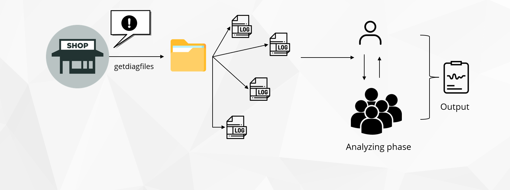
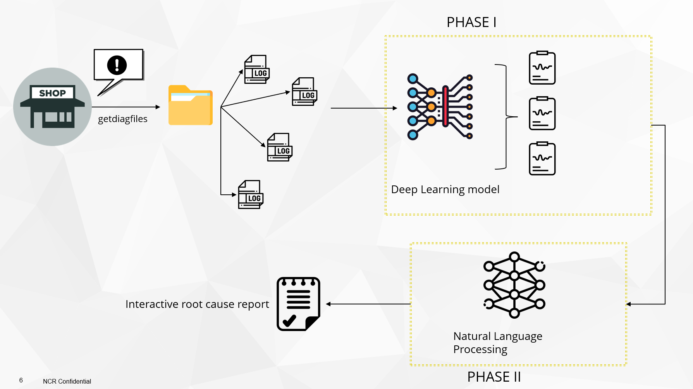
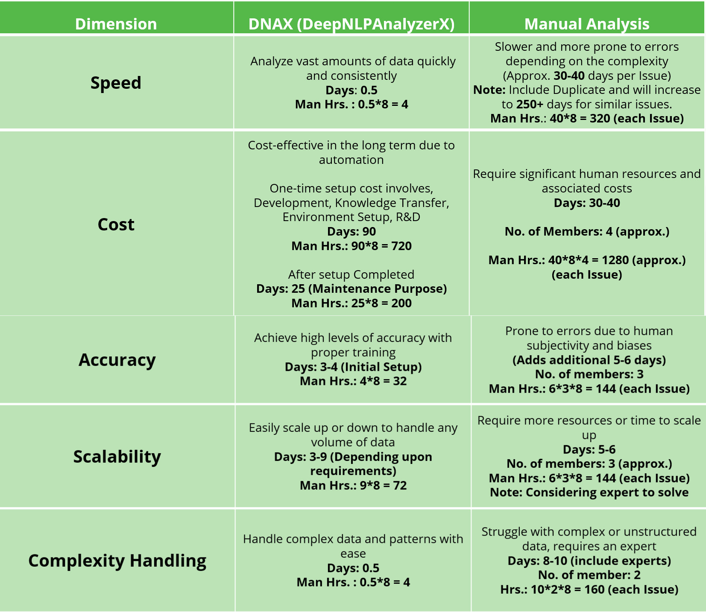
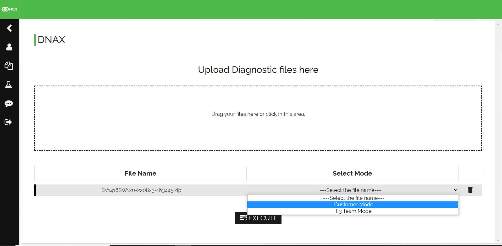
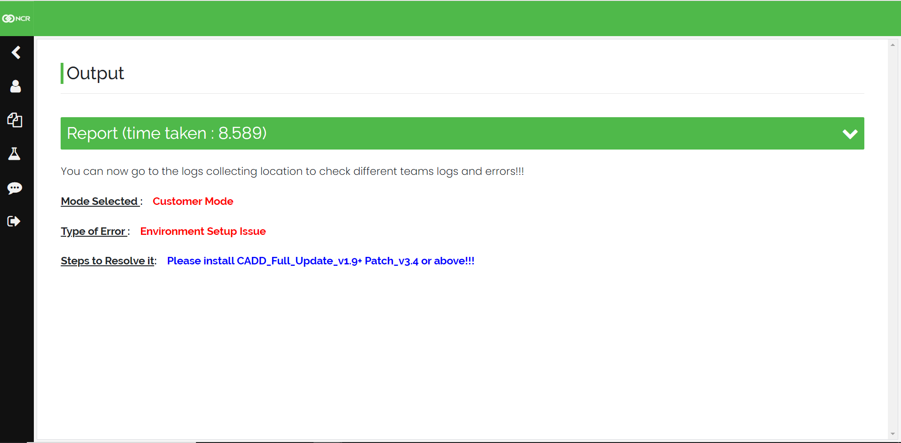
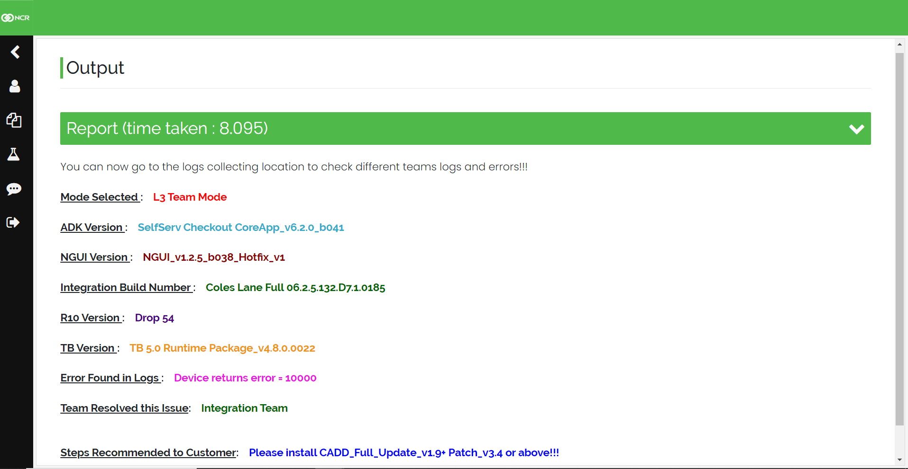

[](https://python.org)
[](https://djangoproject.com)

# **DNAX ( DeepNLPAnalyzerX )**
The tool informs customers &amp; NCR if the issue is related to NCR and provides past successful resolutions that don't require code changes.

>  **Running the Project Locally**

First, clone the repository to your local machine:

```bash
git clone https://github.com/ds185429/DNAX-DeepNLPAnalyzerX-.git
```

Install the requirements:

```bash
pip install -r requirements.txt
```

Apply the migrations:

```bash
python manage.py migrate
```

Collect the Static folder files:

```bash
python manage.py collectstatic
```

Finally, run the development server:

```bash
python manage.py runserver
```
----------------------------------------

## **Problem Statement**

----------------------------------------

1. Log analysis is crucial for software development success,maintenance & support as it helps identify issues and their root cause. 
2. Delays in providing solutions to customers are common and can be attributed to various factors such as inefficient processes, inadequate resources, communication breakdowns, or logistical challenges.
3. Redundant analysis of the problem, incorrect team assignment, and difficulty locating relevant resources are major Contributors to such delays 
4. Delay harms customer satisfaction, raises support expenses, and risks damaging the company's image.

---------------------------------------

## **Proposed Solution**

--------------------------------------

1. DNAX is a tool that assists Customer & NCR personnel by providing guidance on how to resolve problems and identifying the appropriate person to assign the issue to.
2. Notifies customers & NCR about NCR-related issues and suggests previously successful solutions that do not require any changes to the code. 
3. Help Organizations detect and resolve issues quickly and efficiently. 
4. Leading to improved system performance, increased productivity, and reduced downtime. 
5. Allow developers to collaborate more effectively by sharing information and insights. 
6. Insights gained from analyzing software systems and help businesses optimize their performance, identify areas for improvement and make data-driven decisions about future investments.
7. Provide more detailed analysis results to other teams in NCR to improve issue assignment.


-------------------------------------

## **Current Process**

-------------------------------------



**Start**: A customer reports an issue.

**Step 1**: The L3 team receives the issue. 

**Step 2**: The L3 team analyzes the issue and gathers more information. 

**Step 3**: If the issue cannot be resolved by the L3 team, they forward it to the L4 team for further analysis. 

**Step 4**: The L4 team analyzes the issue and determines whether it's their responsibility or that of another team.

**Step 5**: If the issue has any dependencies on other teams, the L4 team follows up with those teams. 

**Step 6**: If the issue is assigned to the L4 team, they communicate the solution to the customer. 

**Step 7**: The L4 team documents the issue for future reference. 

**End**: The issue is resolved.

------------------------------------

## **Using Our Solution**

------------------------------------



> **Scenario 1: Customer Mode**

**Start**: A customer finds an issue.

**Step 1**: The customer generates a diagnostic report by clicking a button on the Launchpad.

**Step 2**: DNAX analyzes the diagnostic report to identify the underlying cause of the issue.

**Step 3**: DNAX presents the customer with a set of actionable steps to resolve the issue.

**Step 4**: The issue is resolved.

<br />

> **Scenario 2: L3 Team Mode**

**Start**: The L3 Team utilizes DNAX Tool for troubleshooting.

**Step 1**: The diagnostic report is analyzed by DNAX to determine the root cause of the issue.

**Step 2**: The tool displays the Environment Details to the L3 Team, who resolve the issue and suggest a solution to the customer.

**Step 3**: Based on prior similar errors, the problem is assigned to the appropriate team for resolution.

**Step 4**: The assigned team conducts further investigations and delivers a resolution to the customer.

**End**: The issue is resolved.

-----------------------------------

## **Phase I - Deep Learning** 

----------------------------------

The first question that comes to mind when we hear "Deep Learning" is: **why should we use it to analyze log errors?**

Deep Learning tools can automatically extract complex text patterns and capture the meaning of words and sentences which makes it a powerful tool for learning about text patterns.

<u>**Our Goal**</u> is to extract errors from specific logs.

Our <u>**NLP algorithm**</u> will have greater availability of solutions for customers as Deep Learning will always provide highly accurate matching log error texts.

Deep learning provides the benefit of **continual learning** which means if it fails to identify a pattern, it can learn about that pattern in the future without wasting time on retraining.


------------------------------------

## **Phase II – NLP Algorithm**

------------------------------------

**Why use NLP when string matching can easily achieve this task?**

Spelling mistakes, different formats, and other discrepancies make exact string matching impossible & hence **Fuzzy string matching** is needed due to variations in the way error codes are written in log files.


NLP techniques aid in fuzzy matching by providing a flexible and nuanced method to compare similar but not identical strings of text.


NLP techniques are useful for recognizing similarities between text strings even if they have variations in spelling, word order, or sentence structure.

**DEMO - NLP Algorithm**

**Scenario 1**: It identifies error log pattern and offers resolution steps.

**Error Text: Device returns error=10000**

```python
soundex = Soundex()

rs = RefinedSoundex()

items = []
for index, row in data.iterrows():
  if soundex.sounds_like(row["Errors"],'Device returns error=10000'):
      print(color.BOLD + "The Error found in your Diag: " +color.RED + row["Errors"] +"\n\n\n" + color.END,color.BOLD + "Please follow below steps as mentioned by that team: \n\n\n" + color.BLUE +  row["Steps to Resolve it"] + color.END)
```

**Output:**
````python    
'The Error found in your Diag': Device returns error = 10000


"Please follow below steps as mentioned by that team": 


Install CADD_Full_Update_v1.9+ Patch_v3.4 or above!!!

````
<br/>

**Scenario 2**: It identifies similar error log pattern and offers resolution steps.

**Error Text: Devicereturnserror=10000**

```python
items = []
for index, row in data.iterrows():
  if soundex.sounds_like(row["Errors"],'Devicereturnserror=10000'):
      print(color.BOLD + "The Error match in your Diag: " +color.RED + row["Errors"] +"\n\n\n" + color.END,color.BOLD + "Please follow below steps as mentioned by that team: \n\n\n" + color.BLUE +  row["Steps to Resolve it"] + color.END)
```

**Output:**
````python    
'The Error found in your Diag': Device returns error = 10000


"Please follow below steps as mentioned by that team": 


Install CADD_Full_Update_v1.9+ Patch_v3.4 or above!!!

````
<br />

**Scenario 3**: It identifies similar error log pattern even wrong pattern came and offers resolution steps.

**Error Text: Devicir returns error=10000**

```python
items = []
for index, row in data.iterrows():
  if soundex.sounds_like(row["Errors"],'Devicir returns error=10000'):
      print(color.BOLD + "The Error matched in your Diag: " +color.RED + row["Errors"] +"\n\n\n" + color.END,color.BOLD + "Please follow below steps as mentioned by that team: \n\n\n" + color.BLUE +  row["Steps to Resolve it"] + color.END)
```

**Output:**
````python    
'The Error found in your Diag': Device returns error = 10000


"Please follow below steps as mentioned by that team": 


Install CADD_Full_Update_v1.9+ Patch_v3.4 or above!!!

````

---------------------------------------------------

## **Technology Stack**

---------------------------------------------------

1. Website Development:
   1. HTML/CSS 
   2. Python 
   3. Django

2. NLP Algorithm 
   1. Python 
   2. Other scripting language (if required)

3. Deep Learning 
   1. Python 
   2. Other scripting language (if required)

4. Database 
   1. SQL / NoSQL

----------------------------------------------------

## **With/without our tool : A Matrix co-relation**

----------------------------------------------------



----------------------------------------------------

## **Prototype/Demo**

----------------------------------------------------

**Scenario 1: Customer Mode**
<br />

**Input:**



**Output:**



<br />

**Scenario 2: L3 Team Mode**
<br />

**Input**


**Output:**



----------------------------------------------------

## **Future Scope**

----------------------------------------------------

Users can access in different modes: as a customer, developer, or member of the L3 team.

Customers to analyze diagnostics without uploading anything.

Automatically troubleshoot certain environment issues without human intervention.

Increase solution's confidence level after resolving issue

An automated process is in place for preparing, adding, or updating error lists. 

Make each component a microservice for use in future tools.

Create website deployment-ready with minimal desktop application dependency.

----------------------------------------------------

## **Team Members**

----------------------------------------------------

**Divyansh Srivastava, PS Engineer - II**
<br />


<br />

**Kalyan Reddi Maddireddi, PS Engineering Manager**
<br />

<br />

**Mithilesh Kumar Devaki, GPS SCO Developer** <br />


<br />

**Seshi Bhargavi Reddy Demada, PS Engineer III** <br />


